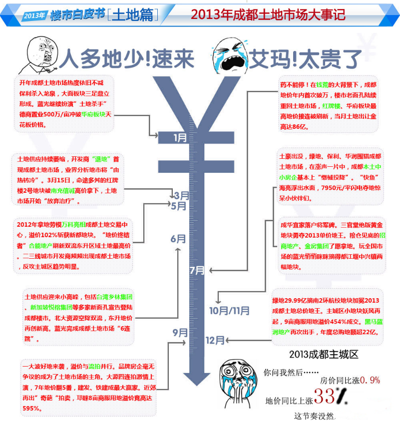
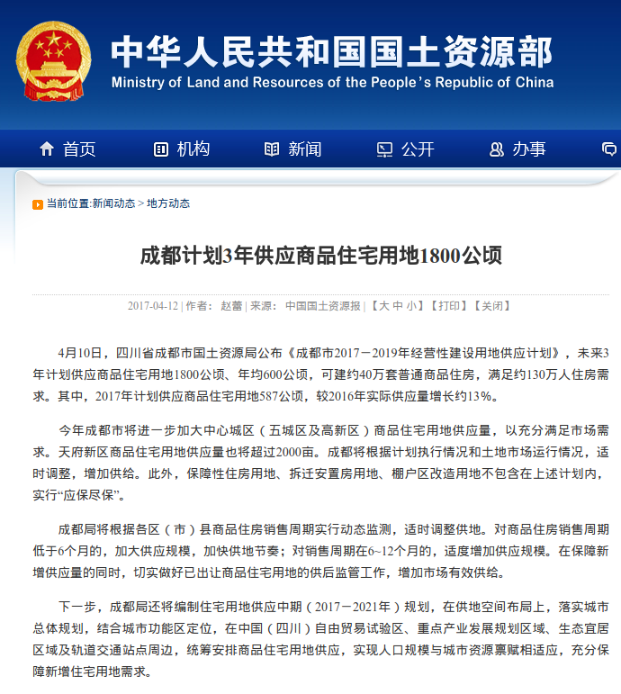
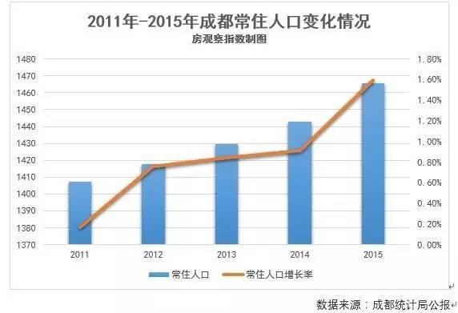

> 本文是2017年所写三篇财经类评论文章的**番外篇**，目前发表在知乎专栏，从成都市土地供给、人口流入两个角度，阐述了对于当时成都楼市的观点。

<!-- more -->

first things first，下面数据来源于**国土资源部**、**成都市国土资源局**。数据如有不详之处，欢迎各位同学指证。

`------安逸成都的分隔线-----`

- 2012年住宅用地计划出让248.65公倾（**3729.75亩**）
- 2013年住宅用地计划出让204.5公倾（**3067.5亩**）
- 2014年住宅用地计划出让240.7公倾（**3610.5亩**）
- 2015年住宅用地计划出让245公倾（**3675亩**）
- 2016年住宅用地计划出让275公顷（**4125亩**）

`------不安逸成都的分隔线------`

- 2017年大成都范围计划出让商品住宅用地8800亩，其中主城5区计划供地2625亩，天府新区超过2000亩，合计**4625亩**。
- 2018年大成都范围计划出让商品住宅用地9000亩（**超过上一年度**）
- 2019年大成都范围计划出让商品住宅用地9200亩（**超过上一年度**）

最近，在查阅最近5年成都市土地出让计划的时候，无意找到一下面这个比较有意思的链接：[《2013年成都楼市白皮书--房地产政策与展望》](http://news.cd.fang.com/zt/201401/2013cdlsbpstd.html)

**2013年**是上一轮房地产周期(*2013-2015*)当中，成都市楼市最火爆的一年，也是地王出没最频繁的年份，上面这张制作于**2013年**的网页兴许能让大家嗅到当年成都楼市与现在相同的火药味。

2013年题主生活在成都，有幸经历过那些年人人抢房的火爆行情。那些年，北京房价才3万；那些年，南边因去年炒作而被重罚的某开发商的A区才刚刚开盘；那些年，题主所在美资公司的HR大姐，出于买到即是赚到的良好愿景，告诉每位参加interview的同学马上置业才是职业生涯的良好开端。那些年，公司还transfer来了一位上海总部的高颜值妹子.......楼歪了，接下来言归正传。

经历了2013年成都楼市的疯狂之后，成都楼市开始进入长达3年的盘整期，由于前期购买力的集中释放，大幅透支市场的潜在购买力，不动产市场开始进入低迷状态，并一直持续到2016年上半年。这段时间，也正是题主自己置业的时间段，对于当时成都不动产市场的状态有着切身体会。

2014年出于遏制2013年楼市火爆而催生出的房价持续上涨预期，央行开启对首套房基准利率上浮10%的定向加息（*限购政策实质在13年已经实施，但限购效果在叠加央行的信贷收紧后，14年才开始得以展现其效果，可见行政性管控手段具有延后性*），随即成都楼市一夜进入冬眠。**进入加息周期之后，房贷杠杆的财富效应，开始展现出其负债的本质**。2015年成都楼市极尽低迷，同样在2013年被疯狂追逐的资产标的，在2015年却是一副烫手山芋状态。与此同时，13年之前上一轮的楼市周期（**08-09年**）修建的大量新房产权落地，并逐步进入二手房市场流通。由此，南沿线开始堆积大量库存，天府新区华府板块崩盘的新闻不绝于报端，有兴趣的同学可以查找一下当年主流媒体的新闻。

接下来在经历**2014-2015*央行2年高达6次的持续降息之后，2016年8月开始，成都楼市从冬眠状态被激活，大量外地购买力、杠杆资金（包含被一线城市挤出）持续性涌入，叠加本地居民和企业的避险资金，在短短一年不到的时间内，实现了主城大部分区域的房价翻番上涨。一时之间，成都楼市的财富效应以及价值洼地的说法甚嚣尘上，并继续吸引全国各路资金和杠杆持续涌入，这种疯狂和失去理智的状态，一直持续到2017年成都的3.23限购政策发布前夕。

综上所述，从`2009年`、`2013年`、`2017年`，成都楼市是经历了3个较完整的房地产周期。

房价暴涨后的成都，围绕不动产的车票论、准一线城市论、自贸区利好论；电梯上、食堂里萦萦不绝；同学群、公司群、健身群、跑步群充斥着房价的话题，有人在讲述自己资产一夜翻番的轶事，有人在捶胸顿足哀叹错失良机。人间百态，就在这房价一降一涨之间。

随即，2017年两会上房产税的难产，被市场解读为对房价上涨的放任，市场开始全面失去理智，**2013年全民炒(投资)房的盛况在时隔四年之后，故伎重演**。

> 上面对着成都楼市的历史，零零总总的继往开来之后，答主希望从更宏观的、更为周期性的角度，重新审视成都楼市的过去与将来，希望藉此能在知乎上人云亦云的看涨声背后，提供一个更为理性的视角。

先从上面成都市住宅用地供应数据说起，从**2013**到**2017**这5年间，无论是房价暴涨的2013年，还是房价低迷库存高企的2015年，亦或是房价又一轮暴涨的2017年，可以从数据中看到，**成都市商业住宅用地的供应整体一直处于非常平稳的状态**。

而2017年4月19日，成都市国土资源局公布的[《成都市2017－2019年经营性建设用地供应计划》](http://www.mlr.gov.cn/xwdt/dfdt/201704/t20170412_1498432.htm)，明确了未来3年全市计划供应商品住宅用地1800公顷(27000亩)、年均600公顷(9000亩)，可建约40万套普通商品住房，满足约130万人住房需求。其中，2017年计划供应商品住宅用地587公顷(8800亩)，较2016年实际供应量增长约13％。

供给侧聊完，接着聊需求侧，下图是2011-2015年成都市人口流入速度变化的情况：

由上图可见，08年地震后，成都市人口流入速度从2011年的0.2%增长到2015年的1.6%，这样的人口流入速度持续4年，结果依然在2016年上半年之前造就了大面积库存。因此，从土地供应与人口流入两个纬度，并不能解释2016-2017年间成都楼市库存快速去化的根本原因，需要结合**利率**、**货币增速**、**居民部门杠杆率**，乃至于**金融供给侧改革**、**银行同业监管**等更加丰富的纬度进行探讨。

首先，成都市土地出让金收入在整体政府财政收入占比过半，而城市的高速发展离不开大量资金的支持，在不改变央地财权、事权分配的格局下，通过投资拉动经济增长仍然是大部分二线城市的现实选择。成都市2017年所提出的【**东进、南拓、西控、北改、中优**】整体城市建设规划思路，依然亟需大量资金介入。因此，成都土地市场的供应必然会维持相对较高充足率，以换取新区建设、企业扶持和培育、招商引资所需要的资金。事实上，**天府新区1484平方公里的规划范围，大部分已经完成土地一级市场的收储，且整体规划基本得以呈现，只需要在合适的时间点(*笔者认为是在配合三四线城市库存去化完毕之后*)进入二级土地市场招拍挂**，由此，从供给角度，成都市目前整体的土地储备依然是较为充裕的。

土地供给侧聊完，再从人口流入的需求侧走起，**按照大成都范围2016年峰值的12万人口/年的流入速度，天府新区的近期规划人口为325万，即达成这一目标即需要30年左右**。这并不包括大成都范围其它区域的规划人口与土地供应，也排除掉更高级别的雄安新区在招商引资、人才吸引方面所形成的竞争，毕竟雄安的规划等同于再造一座现代化产业新城，而新城的企业和人口并不会凭空诞生，而只会在全国一二线城市现有的企业和人口上进行重新分配，因此，对于大部分二线城市而言，在招商和人才两方面都面临着雄安新区的现实竞争。而雄安的定位依然是200万-250万人口，而且会消化掉大部分高科技优质企业，因此对于大部分副省级城市的国家级新区而言，在国家产业结构转型和经济调整的当下，在招商引资这一块，现实情况还是比较严峻的。依然需要通过更大力度的优惠政策来让利于企业、吸引企业，而政策优惠的背后，同样还是需要土地财政来买单，所以回到土地供应的角度上，在稳定不动产价格的前提下，成都市未来的土地供应必然不会呈现一线城市土地政策逐步收紧的态势，**毕竟一线城市对于土地财政的依赖程度反而相对较低**。

如果大家仔细阅读了文章开头的数据，会发现经历了2013年土地供应量的略微下调之后，2014年之后的年份都是逐年在线性递增，那么2014年发生了什么？

对于楼市的探讨，媒体往往过份拘泥于房价收入比、汇率、利率等微观数据的纠缠，而忽略宏观的经济背景与周期。但是微观并不总是能解释宏观，因此才引得无数专家在房价问题上竞相折腰。2014年《新预算法》当中，规范了地方政府举债融资的途径，剥离了融资平台公司的政府融资职能，并对地方债实行限额管理。这一点很大程度制约了当时地方政府的举债行为，但是经济依然需要投资来拉动，GDP连年的考核目标也并没有降低，所以加大土地供应便是地方政府的接下来的又一个现实选择。同样的逻辑，2016年-2017年成都市房价上涨的同时，住宅用地供应速度同样是在持续性递增的，所以笔者才认为成都房价的本次大幅度上涨并非简单的供求所决定。

《新预算法》实施之后，叠加当期经济下滑转型困难，地方政府通过投资拉动经济增长的需求仍然强劲，因此地方性城市商业银行、股份制银行、信托保险等金融机构，开始进行一系列的金融创新，包装地方政府的城投债务，通过表内资产大量出表，加杠杆发行同业理财产品，实现监管套利的同时，为融资平台(例如国家级新区背后的地方性投资集团，名义上是企业，实质为地方政府信用刚性担保的投融资平台)举债受限后的地方政府举债提供了出路，中国特色的影子银行体系也由此诞生。

2011年影子银行规模仅19万亿人民币，而2015年底总量则已超过53万亿元，相当于GDP的79%，而2016年则已经达到64万亿之巨，为市场创造了巨额的流动性和基础货币，而结构调整和经济转型双重压力叠加之下的现实国情，市场上又难以寻觅对应的投资标的，最终资金大量沉淀在楼市，成为推动2011年以来，不动产价格持续走高的真正幕后推手。也成为国家未来经济转型过程当中，不得不去背负的沉疴与负担。

如果说2014年《新预算法》的实施，开启了新一轮的房地产周期。那么近几个月金融系统开展的三套利三违反整治，以及银、证、保三家的监管风暴，则标示着新一轮房地产周期的开启。而最近一段时间以来，各类理财产品七日年化收益率飙升，在银行基准存款利率，乃至于大额存单利率皆维持在极低位的背景下，大量居民存款从传统银行体系流失，抬升了银行等金融机构获取资金的成本，最终导致九折房贷优惠的全面取消，部分商业银行开始推行首套房基准贷款利率上浮10%，通过市场化的手段完成了对楼市的定向加息(2014-2015年的定向加息通过行政手段完成，彼时的利率市场化程度还不如当下这么高)。

终上所述，本轮房地产周期，已然尘埃落定。

2016-2017年这波房价上涨潮，见到不少从一线城市退回来的恐慌性刚需，每个人无一例外的延续着对于一线城市房价的恐慌，不断阐述其在一线城市因为房价而受到的惊吓，这种行为实质也在间接散布着房价上涨预期，从而制造了更大规模的恐慌。

北上深房价的畸高，抛开货币因素外，主要是由于城市人口边际趋于饱和甚至过剩，而土地供应规模又在逐步收缩。生活在这样一座土地供小于求，发展和扩张趋近于饱和的城市，房价自然是节节看涨。但是一线城市人口的快速膨胀，造成各区域产业失衡、生态压力、市政交通的问题由来已久，已经到了不得不解决的地步。因此，只能通过户籍政策、不动产价格将人口挤出到二三线城市，以实现各城市间资源的均衡配置和发展。所以，不必对一线城市的房价作过多的恐慌性解读，毕竟一线城市的人口承载力达到极限，保持城市的良性发展必须维持合理的人口规模。

而针对华北平原缺乏特大型城市的现实，雄安新区的发布实质是一个增量，之前在北京出了一次不短的差，了解到北京现实的生活状况以及人口密度，个人对雄安的前景还是非常的乐观的，深圳特区之外的另一个高科技产业集群，应该在未来5-10年逐步形成。而时任贵阳市委书记的陈刚调任雄安新区临时党委书记，其多年务实的信息化产业建设经验，应该能够有效助推雄安新区的产业落地。