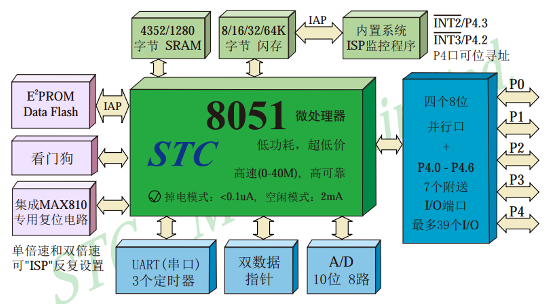
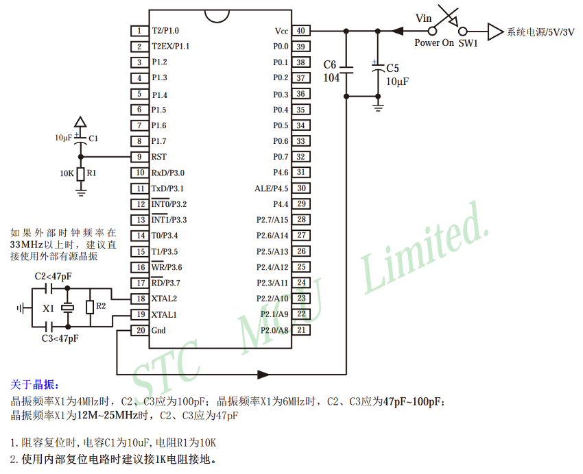
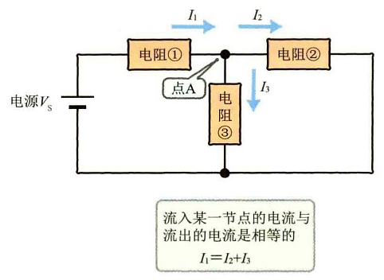

## MCS-51单片机

兼容Intel MCS-51体系架构的一系列单片机，全球有众多的半导体厂商都有基于这一体系架构的产品，例如Atmel的AT89C52， NXP的P89V51，宏晶科技的STC90C516RD+等等。

### STC90C516RD+简介

STC90C516RD+属于5V单片机，工作电压在5.5-3.3V。主要包含`中央处理器CPU`、`程序存储器Flash`、`数据存储器RAM`、`定时/计数器`、`UART串口`、`IO接口`、`EEPROM`、`看门狗`等模块。开发时在Keil集成环境中选择**Intel 8052**进行编译，然后源代码头文件中包含`<reg51.h>`即可。



<!-- more -->

### 单片机上的3种主要资源

1. **Flash 闪存**（*Flash Memory*），主要分为NOR和NADN两种类型，可以在断电条件下存放用户的程序和数据，STC90C516RD+内部集成61K的Flash程序存储器。*早机单片机使用ROM存储器(Read Only Memory)保存程序*。

2. **RAM 随机存取存储器 **（*Random Access Memory*），用于存放程序执行的中间结果和过程数据，掉电后存储内容丢失，STC90C516RD+内部集成了1280字节的RAM。*消费类电子产品上广泛使用的DDR(Double Data Rate SDRAM)就属于RAM*。

3. **SFR 特殊功能寄存器**（*Special Function Register*），对片内各功能模块进行管理、控制、监视的`控制寄存器`和`状态寄存器`。

### 单片机最小系统

**电源**、**晶振**、**复位电路**是构成单片机最小系统不可或缺的3个部分。



#### 电源

供电电路在`40`脚和`20`脚，其中`40`脚接+5V，通常称为VCC代表电源正极，`20`脚接GND代表电源负极。


#### 晶振 `crystal oscillator ['ɒsɪleɪtə(r)]`

晶体振荡器，启动后会一直不停振荡，从而为单片机系统提供基准时钟信号（*单片机内部以该时钟信号为基准进行工作*）。单片机的`18脚`和`9脚`是晶振引脚，电路中使用了12MHZ的晶振（*每秒振荡12次*），外加两个33pF电容帮助晶振起振，并维持振荡信号稳定。


#### 复位电路

下图的复位电路接到了单片机`9脚`的RST复位引脚上，单片机复位一般发生在下面3种情况：

1. 上电复位：保证单片机每次都从一个固定的相同的状态开始工作。

2. 手动复位：按下复位按键，让程序重新初始化重新运行。

3. 程序自动复位：程序长时间失去响应，看门狗模块会自动重启复位单片机。


## 开发板电子元件

### 电流 `Current ['kʌr(ə)nt]`

自由电子的定向运动产生电流，其方向与自由电子运动的方向相反。电流的基本单位是**安培**，用字母**A**表示。

电流I(安培) = 电荷Q(库仑) / 时间t(秒)

> 1秒内通过导体横截面的电荷量为1库仑。

### 电压 `Voltage ['voltɪdʒ]`

高、低电位之间的电位差称为电压，电压的基本单位是**伏特**，用字母**V**表示。

```
电压V(伏特) = 电荷Q(库仑) * 电功W(焦耳)
```

> 1库仑电荷做1焦耳的功形成的电位差等于1伏特。

### 电阻 `Resistor [rɪ'zɪstə]`

用来限制通过其所连支路的电流大小，电阻的基本单位为**欧姆Ω**，用字母**R**表示。电阻值大小一般与*温度*、*材料*、*长度*、*导体横截面积*有关，电阻的主要物理特征是将电能转换为热能，因此可以认为它是一个耗能元件，在电路中通常起到**分压**、**分流**作用。

```
电阻R(欧) = 电阻率ρ(欧·厘米) * [ 长度L(厘米) / 横截面积S(平方厘米) ]
```

### 欧姆定律

通过某段导体的电流跟该段导体两端的电压成正比，电阻成反比。

```
电压V(伏) = 电流I(安) *　电阻R(欧)
```

### 基尔霍夫定律

- **电流定律**：流向某一结点的电流之和恒等于该结点流出的电流之和（*流入流出结点的电流相等*）。



- **电压定律**：某回路的电源电压恒等于各电阻之上的压降之和（*回路中的电压总和是零*）。


### 串联 / 并联


### 电功率


### 电容 `Capacitor [kə'pæsɪtə]`

电容器由两块金属电极之间夹一层绝缘电介质构成。当在两金属电极间加上电压时，电极上就会存储电荷，所以电容器是储能元件。

开发板电路中主要起到缓冲和稳定电流的作用，电容的选取要注意其耐压值（临界电压，过大电压会导致电容器损坏）。

设计数字电路的时候，电源处的去耦高频电容通常选用0.1uF。

> 毫m、微μ、千k、兆m。

### 二极管 `Diode ['daɪəʊd]`

### 三极管 `Triode ['traɪəʊd]`


## USB下载


