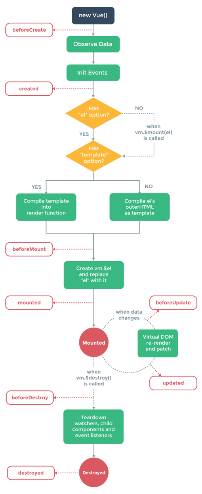

经历2个小型项目的尝试之后，正在和勤智前端团队的小伙伴一起，将前端架构逐步从Angular切换至Vue。为了帮助team里小伙伴们更加快速的上手，所以专门组织了本次training，一方面为大家讲解Vue2带来的各种有趣特性，另一方面聊聊与之前使用Angular的相似与异同。

<!-- more -->

## Vue相比Angular的3个重要区别

1. **组件化**：Angular的设计思想照搬了Java Web开发当中MVC分层的概念，通过`Controller`切割并控制页面作用域，然后通过`Service`来实现复用，是一种对页面进行**纵向**分层的解耦思想。而Vue允许开发人员将页面抽象为若干独立的组件，即将页面DOM结构进行**横向**切割，通过组件完成功能复用、作用域控制，组件对外只提供props和state，并采用Vuex完成组件间的通信和同步。


### 双向绑定


### 虚拟DOM


## Vue对象

每个 Vue 应用都是通过 Vue 函数创建一个新的 Vue 实例开始的

```javascript
var vm = new Vue({
  // 数据
  data: "声明双向绑定的数据对象",
  props: "接收来自父组件的数据",
  propsData: "创建实例时手动传递props，方便测试props",
  computed: "计算属性",
  methods: "定义可以通过vm对象访问的方法",
  watch: "Vue实例化时会调用$watch()方法遍历watch对象的每1个属性",
  // DOM
  el: "将页面上已存在的DOM元素作为Vue实例的挂载目标",
  template: "可以替换挂载元素的字符串模板",
  render: "渲染函数，字符串模板的替代方案",
  renderError: "仅用于开发环境，在render()出现错误时，提供另外的渲染输出",
  // 生命周期钩子
  beforeCreate: "发生在Vue实例初始化之后，data observer和event/watcher事件配置之前",
  created: "发生在Vue实例初始化以及data observer和event/watcher事件被配置之后",
  beforeMount: "挂载开始之前被调用，render()首次被调用",
  mounted: "el被新建的vm.$el替换，并挂载到实例上之后调用",
  beforeUpdate: "数据更新时调用，发生在虚拟DOM重新渲染和打补丁之前",
  updated: "数据更改导致虚拟DOM重新渲染和打补丁之后被调用",
  activated: "keep-alive组件激活时调用",
  deactivated: "keep-alive组件停用时调用",
  beforeDestroy: "实例销毁之前调用，Vue实例依然可用",
  destroyed: "Vue实例销毁后调用，事件监听和子实例全部被移除，释放系统资源",
  // 资源
  directives: "包含Vue实例可用指令的哈希表",
  filters: "包含Vue实例可用过滤器的哈希表",
  components: "包含Vue实例可用组件的哈希表",
  // 组合
  parent: "指定当前实例的父实例，子实例用this.$parent访问父实例，父实例通过$children数组访问子实例",
  mixins: "将属性混入Vue实例对象，并在Vue自身实例对象的属性被调用之前得到执行",
  extends: "用于声明继承另一个组件，从而无需使用Vue.extend，便于扩展单文件组件",
  provide&inject: "2个属性需要一起使用，用来向所有子组件注入依赖，类似于React的Context",
  // 其它
  name: "允许组件递归调用自身，便于调试时显示更加友好的警告信息",
  delimiters: "改变模板字符串的风格，默认为{{}}",
  functional: "使组件无状态(没有data)和无实例(没有this上下文)",
  model: "允许自定义组件使用v-model时定制prop和event",
  inheritAttrs: "默认情况下，父作用域的非props属性绑定会应用在子组件的根元素上。当编写嵌套有其它组件或元素的组件时，可以将该属性设置为false关闭这些默认行为",
  comments: "设为true时会保留并且渲染模板中的HTML注释"
});
```


## Vue对象的实例生命周期





