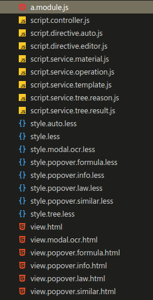

## 为什么选择Angular，而非React？

早在2015年11月的时候，就已经开始尝试使用`webpack`+`babel`+`react`+`reflux`技术栈，但是团队对这种编译式前端开发的反馈并不友好，一方面 webpack1.x版本打包的效率仍然较差，每次保存操作后页面reload速度缓慢，比较影响开发过程中的心情愉悦指数。另一方面，team里的同学对于传统`jQuery`+`backbone`+`handlebar`+`requirejs`开发方式带有思维惯性，不太能接受JSX和ES6模块化的写法。

对于React的组件化思想，我个人是非常赞同的，但是比较遗憾的地方在于facebook并未提供出解决组件间通讯的官方实现，其Virtual DOM与Webpack.sourcemap结合使用后，debug变成一件非常困难的事情，并未在实际开发中体现其性能和效率上的优势。且因为社区驱动的reflux、redux的存在，又为开发带来了额外的复杂度。

**更具有决定因素的是，截至在2015年底，React依然是0.14.x版本，框架自身还处于不断成熟的过程中，API也一直在调整和变化。**

> 在React进入15.x版本之后，穿插使用其完成了一个称为[Saga](https://github.com/uinika/saga)的新项目，新增的context属性结合Redux使用，可以简化组件间通信不少的工作量。

早在2013年beta版发布的时候，Angular就被视为一件神奇的事物，虽然双向绑定的性能问题一直遭到开发人员诟病，但Google从2013年至今一直给予比较完善的支持，形成了成熟的API文档的同时，也提供了大量的最佳实践原则。而Gulp这样基于事件流的前端自动化工具的兴起，简化了前、后端技术架构分离后，前端宿主环境的开发、打包、模拟数据的问题。

**虽然2016年上半年Angluar2已经展露头角，但是从技术成熟度的角度考量，还是最终决定使用Angular1.x。**

截至到目前为止，前端小组的同学已经使用Angular近1年半的时间，其间经历了5个项目、1款产品的考验，积累了许多实践经验，仅在这里做一些总结和分享。

> 2017年，Webpack2、Vue2、Angular4的相继发布，编译式的前端开发已经成为大势所趋，且单页面场景下Angular在性能和组件化解耦方面暴露出非常多不足，目前勤智的前端小组正在全面转向Vue2。

<!-- more -->

## 项目结构

目录build、release主要放置编译、打包压缩后的前端代码，mocks里是基于express编写的模拟restful接口，与前端页面服务分处于不同端口不同域下，因此express中需要进行CORS跨域处理。partials目录下是全部工程代码，内部模块组织结构如下：


将javascript业务、css样式、html表现分离开编写，css采用Less进行预编译，使用gulp先合并全部Less后再处理成css，便于colors、resets等变量全局共享。使用`script.`、`style.`、`view.`前缀便于在vscode或atom中组织代码层次，以体现更加直观、优雅的项目结构。



## Index

一个非常传统的index.html，但是内置了URL的配置模块，方便实施人员根据现场服务环境，对后端URL地址进行修改。但更好的实践是单独将其作为一个config.js文件外部引入，代价是需要调整打包策略，避免gulp对config.js进行代码混淆和压缩操作。

```html
<!DOCTYPE html>
<html lang="zh-CN" ng-app="app" ng-strict-di>

<head>
  <title>Angular Demo</title>
  <meta name="renderer" content="webkit" />
  <meta http-equiv="content-type" content="text/html; charset=UTF-8" />
  <meta http-equiv="X-UA-Compatible" content="IE=edge" />
  <meta name="viewport" content="width=device-width, initial-scale=1" />
  <link rel="icon" href="assets/favicon.ico" type="image/png" />
  <!-- base -->
  <link href="libraries/font-awesome/css/font-awesome.min.css" rel="stylesheet" />
  <link href="libraries/animate/animate.min.css" rel="stylesheet" />
  <!-- jquery plugin -->
  <link href="libraries/bootstrap/css/bootstrap.min.css" rel="stylesheet" />
  <link href="libraries/admin/css/AdminLTE.css" rel="stylesheet" />
  <link href="libraries/admin/css/skins/skin-red-light.css" rel="stylesheet" />
  <!-- angular plugin -->
  <link href="libraries/angular-tree-control/css/tree-control.css" rel="stylesheet" />
  <link href="libraries/angular-ui-tree/angular-ui-tree.min.css" rel="stylesheet" />
  <!-- bundle -->
  <link href="bundles/styles.css" rel="stylesheet" />
</head>

<body class="fixed skin-red-light layout-top-nav">
  <div id="app" ui-view></div>
  <!-- base -->
  <script src="libraries/jquery/jquery.min.js"></script>
  <script src="libraries/lodash/lodash.min.js"></script>
  <script src="libraries/moment/moment-with-locales.min.js"></script>
  <!-- jquery plugin -->
  <script src="libraries/bootstrap/js/bootstrap.min.js"></script>
  <script src="libraries/admin/js/app.js"></script>
  <script src="libraries/jquery-fastclick/fastclick.min.js"></script>
  <script src="libraries/jquery-slimscroll/jquery.slimscroll.min.js"></script>
  <!-- angular -->
  <script src="libraries/angular/angular.js"></script>
  <script src="libraries/angular/angular-animate.js"></script>
  <script src="libraries/angular/angular-messages.js"></script>
  <script src="libraries/angular/angular-aria.js"></script>
  <script src="libraries/angular/i18n/angular-locale_zh-cn.js"></script>
  <script src="libraries/angular/angular-sanitize.js"></script>
  <!-- angular plugin -->
  <script src="libraries/angular-router/angular-ui-router.js"></script>
  <script src="libraries/angular-ui-select/select.min.js"></script>
  <script src="libraries/angular-ui/ui-bootstrap-tpls.js"></script>
  <!-- bundle -->
  <script>
    angular.module("app.common", []).constant("URL", {
      "master": "http://192.168.13.77:8081/test"
      "slave": "http://192.168.13.77:8080/test"
    });
  </script>
  <script src="bundles/scripts.js"></script>
</body>

</html>
```

## App

该文件是整个项目的程序入口点，gulp自动化压缩后会作为bundle.js文件最顶部的一段代码，因此这里开启Javascript严格模式后全局有效。每个js文件都使用自执行的闭包函数进行封装，防止局部变量泄露到全局。run和config代码块编写为单独的函数进行引用，从而避免JS函数过度嵌套后，影响代码的可读性。

```javascript
"use strict";

(function () {

  angular.module("app", [
      // library
      "ngAnimate", "ngSanitize", "ui.router", "ui.bootstrap",
      // custom
      "app.common", "app.login", "app.layout",
    ])
    .config(config)
    .run(run)

  /* config block */
  config.$inject = ["$qProvider", "$stateProvider", "$urlRouterProvider", "$httpProvider"];

  function config($qProvider, $stateProvider, $urlRouterProvider, $httpProvider) {};

  /* run block */
  run.$inject = ["$rootScope"];

  function run($rootScope) {}

})();
```

## Module

为了更直观的体现**Angular模块化**的概念，会将如下代码新建为单独的`a.module.js`文件，主要用于模块的依赖声明，以及嵌套路由配置。其中，路由使用了[ui-router](https://github.com/angular-ui/ui-router/wiki)提供的方案，父级路由使用`abstract`属性和`template:"<ui-view/>"`来实现与子路由的松耦合。

Angular module中的路由配置是整份前端代码的切割点，通过它完成了整个单页面应用在源码层面的文件切分。更重要的是，通过`controllerAs`的使用，在接下来的控制器中，通过`this`指针代替传统`$scope`的写法，有助于避免在有嵌套的controller中调用`$parent`，有效防止作用域污染的发生。

```javascript
(function () {
  
  angular
    .module("app.template", []);

  angular
    .module("app.template")
    .config(templateConfig);

  templateConfig.$inject = ["$stateProvider"];

  function templateConfig($stateProvider) {
    $stateProvider
      .state("template", {
        parent: "layout",
        abstract: true,
        url: "/template",
        template: "<ui-view/>"
      })
      // Judged
      .state("template.judged", {
        parent: "template",
        url: "/judged",
        templateUrl: "partials/template/judge/view.html",
        controller: "TemplateJudgeController",
        controllerAs: "Judge"
      })
      // Trial
      .state("template.trial", {
        parent: "template",
        url: "/trial",
        templateUrl: "partials/template/trial/view.html",
        controller: "TemplateTrialController",
        controllerAs: "Trial"
      })
  }

})();
```

## Controller

控制器中，通过`$inject`手动实现依赖注入，避免代码压缩合并后出现依赖丢失的情况。将`this`指针赋值给`vm`对象（view model），其它方法和属性都以子对象的形式挂载到vm下面，使其更加整洁和面向对象。

由于Angular会自动绑定未在HTML中声明的属性，因此约定将所有双向绑定属性声明到vm对象当中，且通过赋予其默认值来表达所属数据类型。

> 下面代码中的`activate()`函数主要用来放置controller的初始化逻辑。

```javascript
(function () {

  angular
    .module("app.login")
    .controller("LoginController", LoginController);

  LoginController.$inject = ["loginService", "$state", "verify", "$uibModal", "$scope"];

  function LoginController(loginService, $state, verify, $uibModal, $scope) {
    var vm = this;

    // initialization
    function activate() {};

    // two-way data binding on view
    vm.account = {
      username: "",
      password: "",
      message: "",
      onSubmit: function () {
        loginService.auth({
            username: vm.account.username,
            password: vm.account.password
          })
          .then(function (result) {
            if (loginService.validate(result)) {
              vm.account.message = result.message;
            }
          })
      }
    };

    // initialization function invoked
    activate();
  };

})();
```

## Service

主要用来放置数据操作和数据交互的逻辑，例如：*负责XHR请求、本地存储、内存存储和其它任何数据操作*。最后，Service通过返回一个对象来组织这些服务。通常情况下，项目每个模块只拥有一个controller，但是可以存在多个service，Angular的设计理念就是寄希望通过service来完成业务的复用，这一点主要继承了传统MVC的分层思想。

> Angular的service总是单例的，这意味每个`injector`都只有一个实例化的`service`。

```javascript
(function () {

  angular
    .module("app.login")
    .service("loginService", loginService);

  loginService.$inject = ["$http", "URL"];

  function loginService($http, URL) {
    var path = URL.master;
    return {
      auth: function (data) {
        return $http.post(
            path + "/login", data
          )
          .catch(function (error) {
            console.error(error);
          })
      },
      validate: function () {
        // it is a login validator
      }
    }
  };

})();
```

## Directive

指令的命名需要使用一个短小、唯一、具有描述性的前缀（*比例企业名称*），可以通过在指令配置对象中使用`controllerAs`属性，取得与控制器中vm同样的用法，

> 使用controllerAs属性时，如果需要把父级作用域绑定到指令controller属性指定的作用域时，可以使用`bindToController=true`。

```javascript
(function () {

  /**
   * @type directive
   * @name wiserv-scroll
   * @param wiserv-scroll-offset
   * @description auto resize base on overflow-y
   */
  angular.module("app.common")
    .directive("wiservScroll", wiservScroll);

  wiservScroll.$inject = ["$window", "$document"];

  function wiservScroll($window, $document) {
    return {
      restrict: "ACE",
      scope: {
        offset: "@wiservScrollOffset"
      },
      link: function link(scope, element, attrs) {
        var _window = $($window);
        var _document = $($document);
        var _offset = $window.parseInt(scope.offset);

        format();

        _window.resize(function () {
          format();
        })

        function format() {
          // scroll
          element.css({
            "overflow-y": "scroll"
          });
          // size
          var contentHeight = _window.height() || 0;
          var navbarHeight = _document.find(".main-header").outerHeight() || 0;
          var boxheaderHeight = _document.find(".box-header").outerHeight() || 0;
          // calculate
          element.outerHeight((contentHeight - navbarHeight - boxheaderHeight) - _offset);
        }
      }
    };
  };

  /**
   * @type directive
   * @name slim-scroll
   * @param slim-scroll-offset slim-scroll-width slim-scroll-color slim-scroll-edge
   * @description auto resize base on slimscroll
   */
  angular.module("app.common")
    .directive("slimScroll", slimScroll);

  slimScroll.$inject = ["$window", "$document"];

  function slimScroll($window, $document) {
    return {
      restrict: "ACE",
      scope: {
        height: "@slimScrollOffset",
        size: "@slimScrollWidth",
        color: "@slimScrollColor",
        distance: "@slimScrollEdge"
      },
      link: function link(scope, element, attrs) {
        var _window = $($window);
        var _document = $($document);
        // property
        var _height = $window.parseInt(scope.height);
        var _size = scope.size ? (scope.size + "px") : ("6px");
        var _color = scope.color ? (scope.color + "") : ("red");
        var _distance = scope.distance ? (scope.distance + "px") : ("0px");

        format();

        _window.resize(function () {
          format();
        });

        function format() {
          // size
          var contentHeight = _window.height() || 0;
          var navbarHeight = _document.find(".main-header").outerHeight() || 0;
          var boxheaderHeight = _document.find(".box-header").outerHeight() || 0;
          // calculate
          element.slimScroll({
            height: ((contentHeight - navbarHeight - boxheaderHeight) - _height) + "px",
            color: _color,
            size: _size,
            distance: _distance,
            alwaysVisible: true
          });
        };

      }
    };
  };
})();
```

## JWT风格的权限校验

JWT（*JSON Web Token*）是一种JSON风格的轻量级的授权和身份认证规范，主要用于前后端分离之后，在不借助cookie和session的场景下（*部分移动端浏览器未实现相关特性*），对每次浏览器端发起的HTTP请求进行拦截校验。

单页面场景下，权限认证需要解决如下3个核心问题：

1. 登陆校验成功后，持有服务器端生成的token令牌。
2. 每次HTTP请求都需要持有该token令牌的信息。
3. 登陆超时和访问未授权页面的处理（通常为跳转）。

> 如下代码为项目入口点`config代码块`的配置，用于获取并放置token令牌，以及处理登陆超时的跳转。

```javascript
config.$inject = ["$qProvider", "$stateProvider", "$urlRouterProvider", "$httpProvider"];

function config($qProvider, $stateProvider, $urlRouterProvider, $httpProvider) {
  $qProvider.errorOnUnhandledRejections(false);
  $urlRouterProvider.otherwise("/login");
  $stateProvider
    .state("login", {
      url: "/login",
      templateUrl: "partials/login/view.html",
      controller: "LoginController",
      controllerAs: "Login"
    })
    .state("layout", {
      url: "/layout",
      templateUrl: "partials/layout/view.html",
      controller: "LayoutController",
      controllerAs: "Layout"
    })

  /** HTTP Interceptor */
  $httpProvider.interceptors.push(interceptor);
  interceptor.$inject = ["$q", "$location"];

  function interceptor($q, $location) {
    return {
      "request": function (config) {
        var token = sessionStorage.token;
        if (token) {
          config.headers = _.assign({}, {
            "Authorization": "Wiserv " + token
          }, config.headers)
        };
        return config;
      },
      "response": function (response) {
        $q.when(response, function (result) {
          if (response.data && response.data.head && typeof response.data === "object") {
            if (result.data.head.status === 202) {
              sessionStorage.message = "登录超时，请重新登录！";
              $location.url("/wiserv");
            };
          };
        });
        return response;
      }
    };
  };

};
```

> 如下代码为项目入口点`run代码块`的配置，主要是处理未登陆访问授权页面的跳转。

```javascript
run.$inject = ["$rootScope"];

function run($rootScope) {
  // router listener
  $rootScope.$on("$stateChangeStart",
    function (event, toState, toParams, fromState, fromParams) {
      if (toState.name !== "login") {
        if (!sessionStorage.token) {
          window.location.href = "/wiserv";
        };
      };
    });
};
```

# Filter

## Module中的Run和Config代码块

Run和Config分别是Aangular模块加载的2个生命周期：

1. **Config**：首先执行的是Config阶段，该阶段发生在provider注册和配置的时候，主要用于连接并注册好所有数据源，因此**provider**、**constant**都可以注入到Config代码块中，但是其它不确定是否初始化完成的服务不能注入进来。
2. **run**：其次开始进入Run阶段，该阶段发生在injector创建完成之后，主要用于启动应用，是Angular中最接近C语言main方法的概念。为了避免在模块启动之后再进行配置操作，所以只允许注入**service**、**value**、**constant**。

## 如何理解Provider

## 脏数据检查机制

## 跨控制器的事件交互

$on $emit $broadcast

## 指令的生命周期

complie和link

## $location的配置

Hashbang模式
HTML5模式