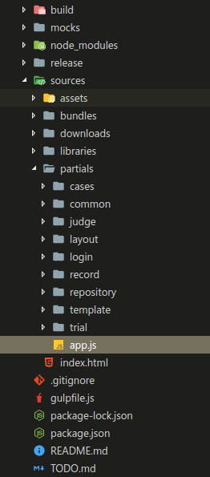

## 为什么选择Angular，而非React？

早在2015年11月的时候，就已经开始尝试使用`webpack`+`babel`+`react`+`reflux`技术栈，但是团队对这种编译式前端开发的反馈并不友好，一方面 webpack1.x版本打包的效率仍然较差，每次保存操作后页面reload速度缓慢，比较影响开发过程中的心情愉悦指数。另一方面，team里的同学对于传统`jQuery`+`backbone`+`handlebar`+`requirejs`开发方式带有思维惯性，不太能接受JSX和ES6模块化的写法。

对于React的组件化思想，我个人是非常赞同的，但是比较遗憾的地方在于facebook并未提供出解决组件间通讯的官方实现，其Virtual DOM与Webpack.sourcemap结合使用后，debug变成一件非常困难的事情，并未在实际开发中体现其性能和效率上的优势。且因为社区驱动的reflux、redux的存在，又为开发带来了额外的复杂度。

**更具有决定因素的是，截至在2015年底，React依然是0.14.x版本，框架自身还处于不断成熟的过程中，API也一直在调整和变化。**

> 在React进入15.x版本之后，穿插使用其完成了一个称为[Saga](https://github.com/uinika/saga)的新项目，新增的context属性结合Redux使用，可以简化组件间通信不少的工作量。

早在2013年beta版发布的时候，Angular就被视为一件神奇的事物，虽然双向绑定的性能问题一直遭到开发人员诟病，但Google从2013年至今一直给予比较完善的支持，形成了成熟的API文档的同时，也提供了大量的最佳实践原则。而Gulp这样基于事件流的前端自动化工具的兴起，简化了前、后端技术架构分离后，前端宿主环境的开发、打包、模拟数据的问题。

**虽然2016年上半年Angluar2已经展露头角，但是从技术成熟度的角度考量，还是最终决定使用Angular1.x。**

截至到目前为止，前端小组的同学已经使用Angular近1年半的时间，其间经历了5个项目、1款产品的考验，积累了许多实践经验，仅在这里做一些总结和分享。

> 2017年，Webpack2、Vue2、Angular4的相继发布，编译式的前端开发已经成为大势所趋，且单页面场景下Angular在性能和组件化解耦方面暴露出非常多不足，目前勤智的前端小组正在全面转向Vue2。

## 项目结构



### index.html

```html
<!DOCTYPE html>
<html lang="zh-CN" ng-app="app" ng-strict-di>

<head>
  <title>Angular Demo</title>
  <meta name="renderer" content="webkit" />
  <meta http-equiv="content-type" content="text/html; charset=UTF-8" />
  <meta http-equiv="X-UA-Compatible" content="IE=edge" />
  <meta name="viewport" content="width=device-width, initial-scale=1" />
  <link rel="icon" href="assets/favicon.ico" type="image/png" />
  <!-- base -->
  <link href="libraries/font-awesome/css/font-awesome.min.css" rel="stylesheet" />
  <link href="libraries/animate/animate.min.css" rel="stylesheet" />
  <!-- jquery plugin -->
  <link href="libraries/bootstrap/css/bootstrap.min.css" rel="stylesheet" />
  <link href="libraries/admin/css/AdminLTE.css" rel="stylesheet" />
  <link href="libraries/admin/css/skins/skin-red-light.css" rel="stylesheet" />
  <!-- angular plugin -->
  <link href="libraries/angular-tree-control/css/tree-control.css" rel="stylesheet" />
  <link href="libraries/angular-ui-tree/angular-ui-tree.min.css" rel="stylesheet" />
  <!-- bundle -->
  <link href="bundles/styles.css" rel="stylesheet" />
</head>

<body class="fixed skin-red-light layout-top-nav">
  <div id="app" ui-view></div>
  <!-- base -->
  <script src="libraries/jquery/jquery.min.js"></script>
  <script src="libraries/lodash/lodash.min.js"></script>
  <script src="libraries/moment/moment-with-locales.min.js"></script>
  <!-- jquery plugin -->
  <script src="libraries/bootstrap/js/bootstrap.min.js"></script>
  <script src="libraries/admin/js/app.js"></script>
  <script src="libraries/jquery-fastclick/fastclick.min.js"></script>
  <script src="libraries/jquery-slimscroll/jquery.slimscroll.min.js"></script>
  <!-- angular -->
  <script src="libraries/angular/angular.js"></script>
  <script src="libraries/angular/angular-animate.js"></script>
  <script src="libraries/angular/angular-messages.js"></script>
  <script src="libraries/angular/angular-aria.js"></script>
  <script src="libraries/angular/i18n/angular-locale_zh-cn.js"></script>
  <script src="libraries/angular/angular-sanitize.js"></script>
  <!-- angular plugin -->
  <script src="libraries/angular-router/angular-ui-router.js"></script>
  <script src="libraries/angular-ui-select/select.min.js"></script>
  <script src="libraries/angular-ui/ui-bootstrap-tpls.js"></script>
  <!-- bundle -->
  <script>
    angular.module("app.common", []).constant("URL", {
      "master": "http://192.168.13.77:8081/test"
      "slave": "http://192.168.13.77:8080/test"
    });
  </script>
  <script src="bundles/scripts.js"></script>
</body>

</html>
```

### app.js

```javascript
"use strict";

(function () {

  angular.module("app", [
      // library
      "ngAnimate",
      "ngSanitize",
      "ui.router",
      "ui.bootstrap",
      // custom
      "app.common",
      "app.login",
      "app.layout",
    ])
    .config(config)
    .run(run)

  /* 配置块 */
  config.$inject = ["$qProvider", "$stateProvider", "$urlRouterProvider", "$httpProvider"];

  function config($qProvider, $stateProvider, $urlRouterProvider, $httpProvider) {};

  /* 运行块 */
  run.$inject = ["$rootScope"];

  function run($rootScope) {}

})();
```

### controller.js

### service.js

### directive.js

### http.js

